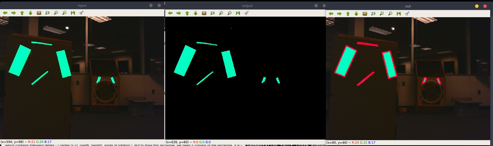

# wheatley2019
2019 FRC robot code for Wheatley

TODO
---
 - add cameras
 - add encoders
 - add autonomous(encoders)
 - add IMU + Encoder fusion algorithm
 - add camera tracker
 - interface cameratracker to jetson, communicate with roboRIO over NetworkTables
 - stream iris cam
 - update, configure CAN ids on PDP and PCM

 - **Robot Build**
   - add pneumatic panel
   - mount air tanks to drivetrain
   - front panel for cylinders
   - cable mgmt
   - mount side panels
   - drive practice!

Notes
---
  - i2c stuff: https://robotpy.readthedocs.io/projects/wpilib/en/stable/hal.html#i2c-spi-simulation-helpers
  - robot simulator: https://robotpy.readthedocs.io/projects/pyfrc/en/stable/api.html
  - networktables: https://robotpy.readthedocs.io/projects/pynetworktables/en/stable/api.html
  - pathfinder: https://github.com/robotpy/robotpy-pathfinder

DONE
---
 - install robotpy
 - add drive base class
 - add subsystem components
 - write LED code
 - set up electronics
 - finish building robot
   - drivetrain
   - frame
   - wrist
   - intake
   - electrical panel
